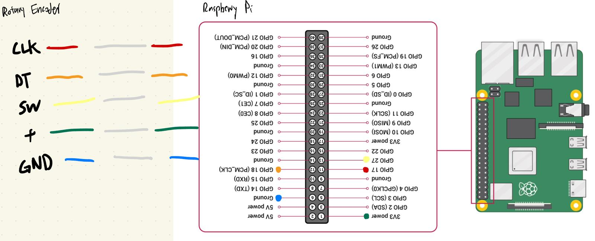

# About the Project
This project connects a **rotary encoder** (e.g., KY-040) to a **Raspberry Pi**, publishes its events via **MQTT**, and integrates with **Home Assistant** to control smart lights (Tapo).  
The script listens to encoder rotations and button presses, publishing them to an MQTT topic. Home Assistant reacts to those events to change brightness or toggle the lamp.

# Built With
- [gpiozero](https://gpiozero.readthedocs.io/en/stable/) - GPIO library for the Raspberry Pi
- [paho-mqtt](https://pypi.org/project/paho-mqtt/) - MQTT client library
- [Mosquitto](https://mosquitto.org/) - MQTT broker
- [Raspberry Pi](https://www.raspberrypi.com/) - The hardware platform
- [Tapo Lights](https://www.tp-link.com/en/home-networking/smart-light-bulb/) - The smart lights being controlled

# Getting Started
## Prerequisites
- Raspberry Pi with Home Assistant container deployed
- Rotary Encoder (e.g., KY-040)
- Tapo Smart Light Bulb

## Installation
## 0. Hardware Setup
| Encoder Pin | Raspberry Pi Pin |
|-------------|------------------|
| CLK         | GPIO17 (Pin 11)  |
| DT          | GPIO18 (Pin 12)  |
| SW (Button) | GPIO27 (Pin 13)  |
| VCC         | 3.3V (Pin 1)     |
| GND         | GND (Pin 6)      |


## 2. Clone the repository
```bash
git clone https://github.com/YiXin-Tan/rpi-sensor-mqtt.git
cd rpi-sensor-mqtt
```
## 3. Install dependencies
```bash
pip install -r requirements.txt
```

## 4. Configure .env
Fill in your MQTT broker details:
use 172.0.0.1 if broker is on same Pi and not in a container

```
# MQTT connection
MQTT_HOST=127.0.0.1      # MQTT broker address
MQTT_PORT=1883           # MQTT broker port
MQTT_USER=               # MQTT username (if configured)
MQTT_PASSWORD=           # MQTT password (if configured)
MQTT_TOPIC=inputs/rotary/lamp   # MQTT topic to publish encoder events

# GPIO pins
GPIO_CLK=17              # Rotary encoder CLK pin
GPIO_DT=27               # Rotary encoder DT pin
GPIO_SW=22               # Rotary encoder switch (button) pin

# Behaviour tuning
STEP_PCT=5               # % brightness step per tick
DEBOUNCE_MS=2            # Debounce delay in milliseconds
```


## Install Mosquito MQTT Broker
```bash
sudo apt update
apt install -y mosquitto mosquitto-clients
sudo mosquitto_passwd -c /etc/mosquitto/passwd homeuser # set password
```

### Test with two terminals
Subscriber
```bash
mosquitto_sub -h localhost -p 1883 -u <username> -P <password> -t 'inputs/rotary/lamp' -v
```
Publisher
```bash
mosquitto_pub -h localhost -p 1883 -u <username> -P <password> -t 'inputs/rotary/lamp' -m 'toggle'
````

## Home Assistant Setup
### Add the MQTT Integration
In your Home Assistant dashboard, go to Settings > Devices & Services > Add integration
Select MQTT, then enter your broker details (IP, port, broker username, broker password)

### Amend automations.yaml
Append to /docker/home-assistant/data/automations.yaml to respond to MQTT messages published by the script
See [automation.yaml](https://github.com/YiXin-Tan/rpi-sensor-mqtt/blob/main/setup/automation.yaml) which contains:
- Decrease brightness
- Toggle lamp
- Increase brightness

## Run the script as a service 
Ensures the script starts on boot and keep it running in the background
### 1. Create a systemd unit
Create /etc/systemd/system/rpi-mqtt.service
See [rpi-mqtt.service.example](https://github.com/YiXin-Tan/rpi-sensor-mqtt/blob/main/setup/rpi-mqtt.service.example) for example

### 2. Enable and start the service
```bash
sudo systemctl daemon-reload
sudo systemctl enable --now rpi-mqtt.service
```

### 3. Check service status
```bash
sudo systemctl status rpi-mqtt.service
```


## Maintenance Commands
Follow live logs
```bash
journalctl -u rpi-mqtt.service -f
```

View historic logs
```bash
journalctl -u rpi-mqtt.service
```

Restart after editing the script
```bash
sudo systemctl restart rotary-mqtt.service
```

Stop service
```bash
sudo systemctl stop rotary-mqtt.service
```

Disable autostart
```bash
sudo systemctl disable rotary-mqtt.service
```
